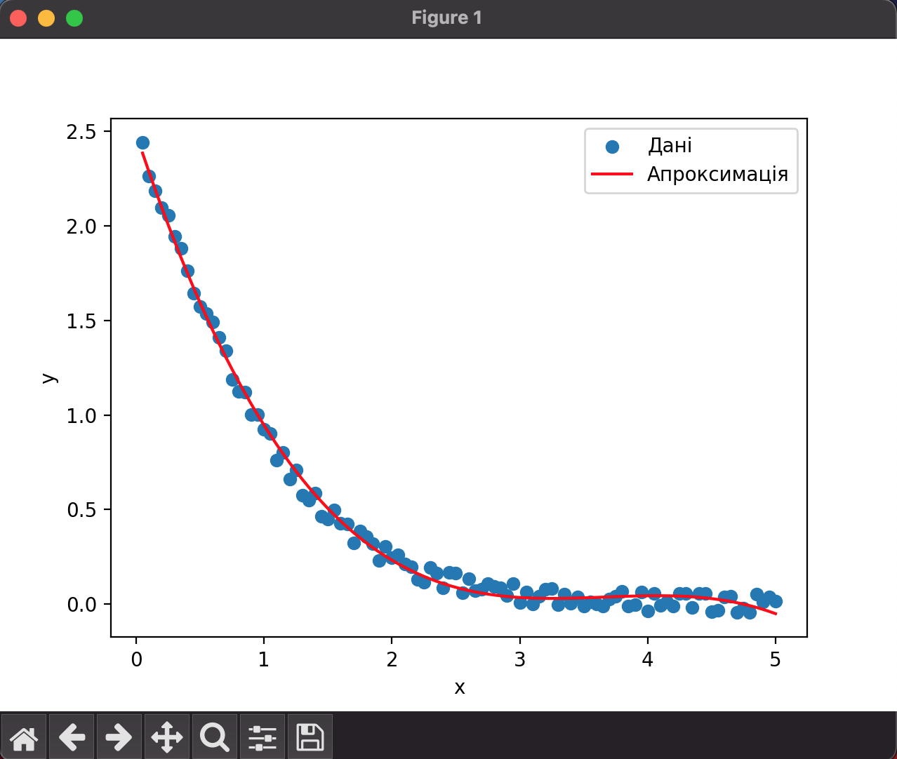
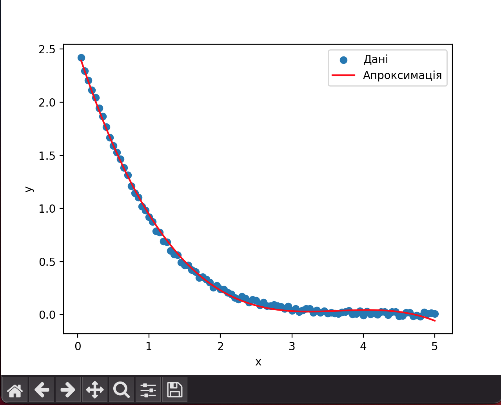
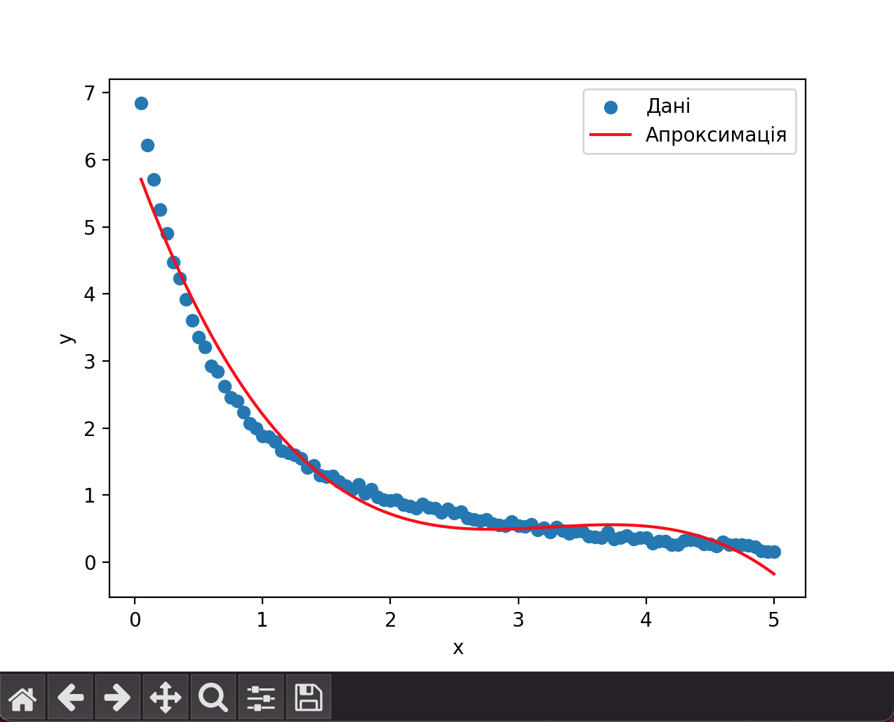
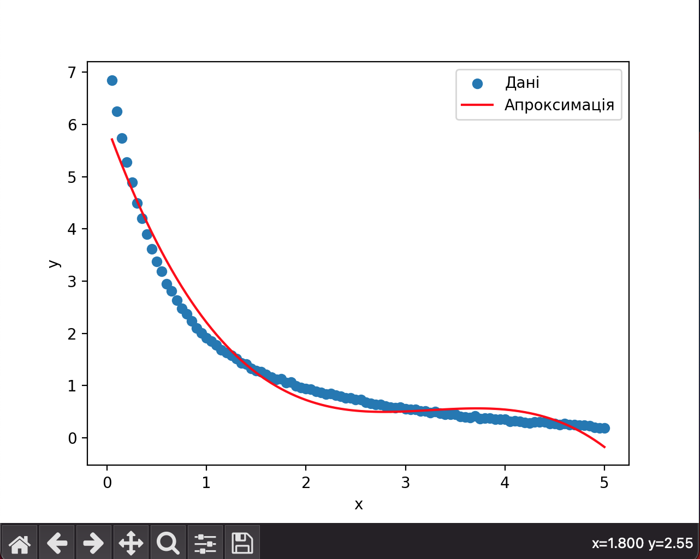
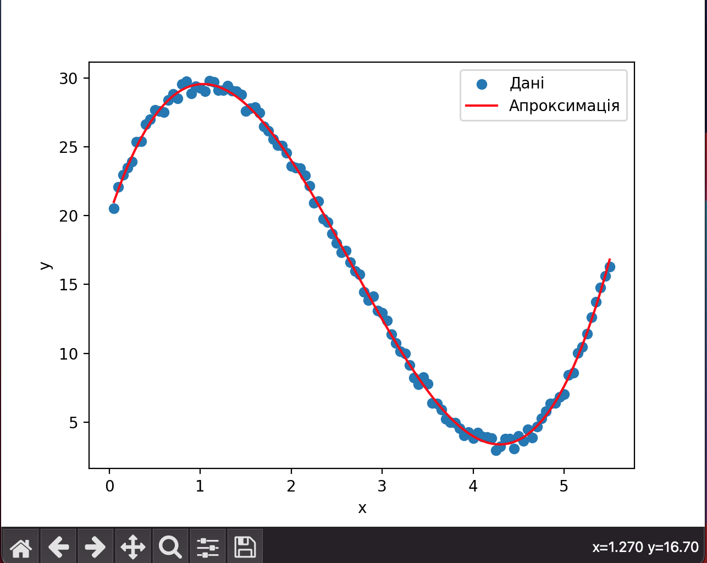
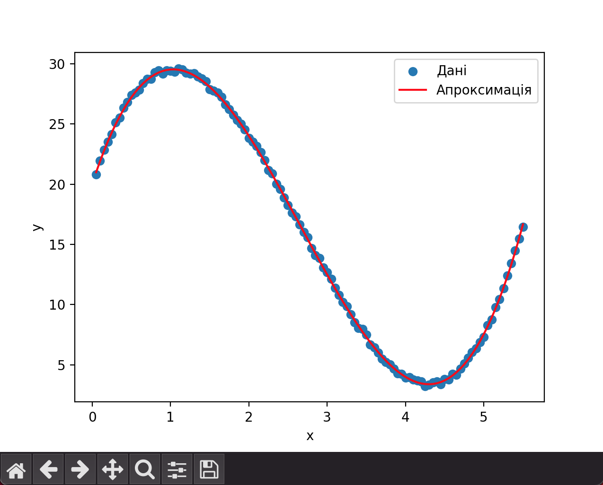
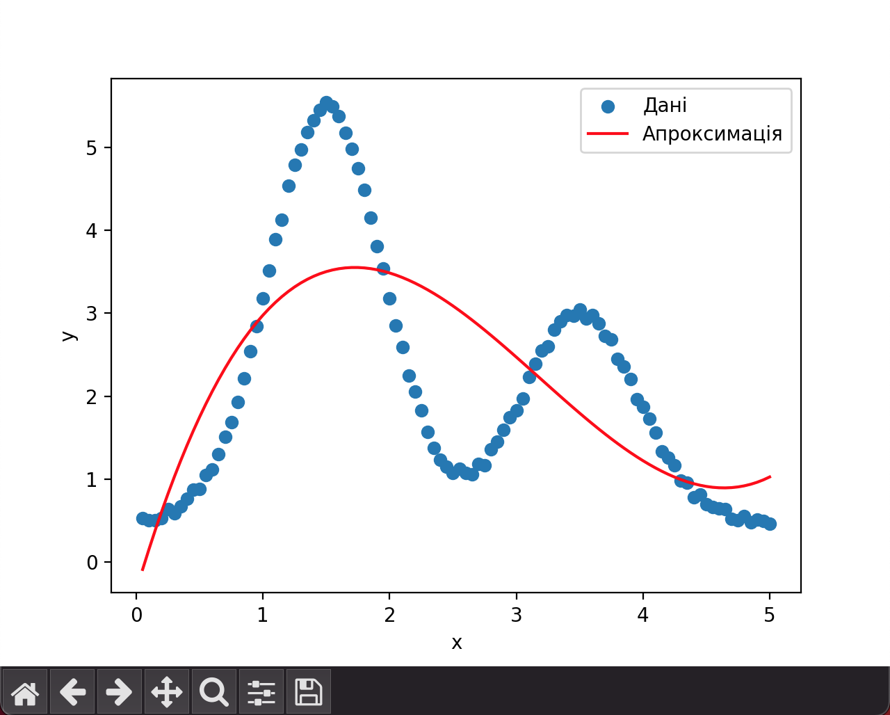

---

## Results

---
```
Для файлу fit_Dm_1.dat
Коефіцієнти полінома: [-0.05170742  0.56867382 -2.05851386  2.48737951]
```


---

```
Для файлу fit_Dm_1c.dat
Коефіцієнти полінома: [-0.05254321  0.57531731 -2.07330668  2.49383234]
```



---

```
Для файлу fit_Dm_2.dat
Коефіцієнти полінома: [-0.16813678  1.64229755 -5.23705769  5.96838652]
```


---

```
Для файлу fit_Dm_2c.dat
Коефіцієнти полінома: [-0.16832566  1.64306205 -5.23709187  5.97120308]
```


---

```
Для файлу fit_Dm_3.dat
Коефіцієнти полінома: [  1.51021739 -12.06314189  20.07797737  20.02681046]
```


---

```
Для файлу fit_Dm_3c.dat
Коефіцієнти полінома: [  1.50408696 -12.02525676  20.03119094  20.01072419]
```


---

```
Для файлу fit_Dm_4.dat
Коефіцієнти полінома: [ 0.21494936 -2.05217423  5.16118146 -0.34646717]
```


---